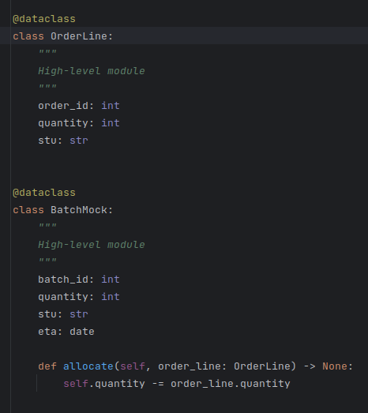

### Abstraction

* **Abstraction** is higher level of the classes that encapsulates all component logic.
* Abstraction can be an interface or a class

### Dependencies
      
#### Func( DI ) -> Class ( High-level Abstraction Class ) <- Low-level Instance

#### Func( DI ) -> Interface <- Low-level Class

### DDD

### Low-level modules 

* outer layer

### High-level modules

* inner layer
* Abstraction

### High level concepts should not depend on Low-level conepts by architecture circle

* Because use cases are specificBecause use cases are specific

### Entity is *Critical Business Data* + *Critical Business Rules*

* Entities are pure business and nothing else

* Entity is a small set of business rules operating on Critical Business Data.

* All that is required is that you bind the Critical Business Data and the Critical Business Rules together in a single
and separate software module named Entity.

### UseCase description of the way that an automated system is used that specify application-specific business rules

* UseCase specify application-specific business rules

* UseCase is a description of the way that an automated system is used

* Use cases contain the rules that specify how and when the Critical Business Rules
within the Entities are invoked

* Use cases do not describe how the system appears to the user.
Instead, they describe the application-specific rules that govern the interaction
between the users and the Entities.

* A use case is an object. It has one or more functions that implement the application-
specific business rules