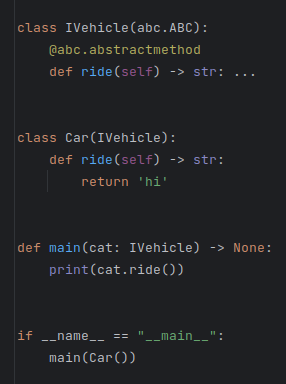
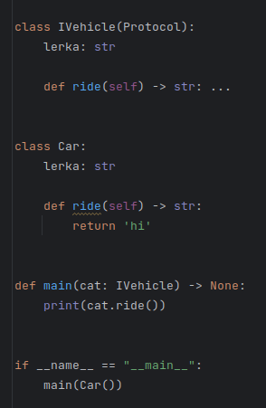

# Interfaces

### abc.ABC - RunTime and Static checkers check only methods

### typing.Protocol - Static checker checks methods and variables

### Quantity = NewType('Hi', int), SKU = NewType('Hi', int) 

* Is the new unique type that can help you to understand that some property not on the place