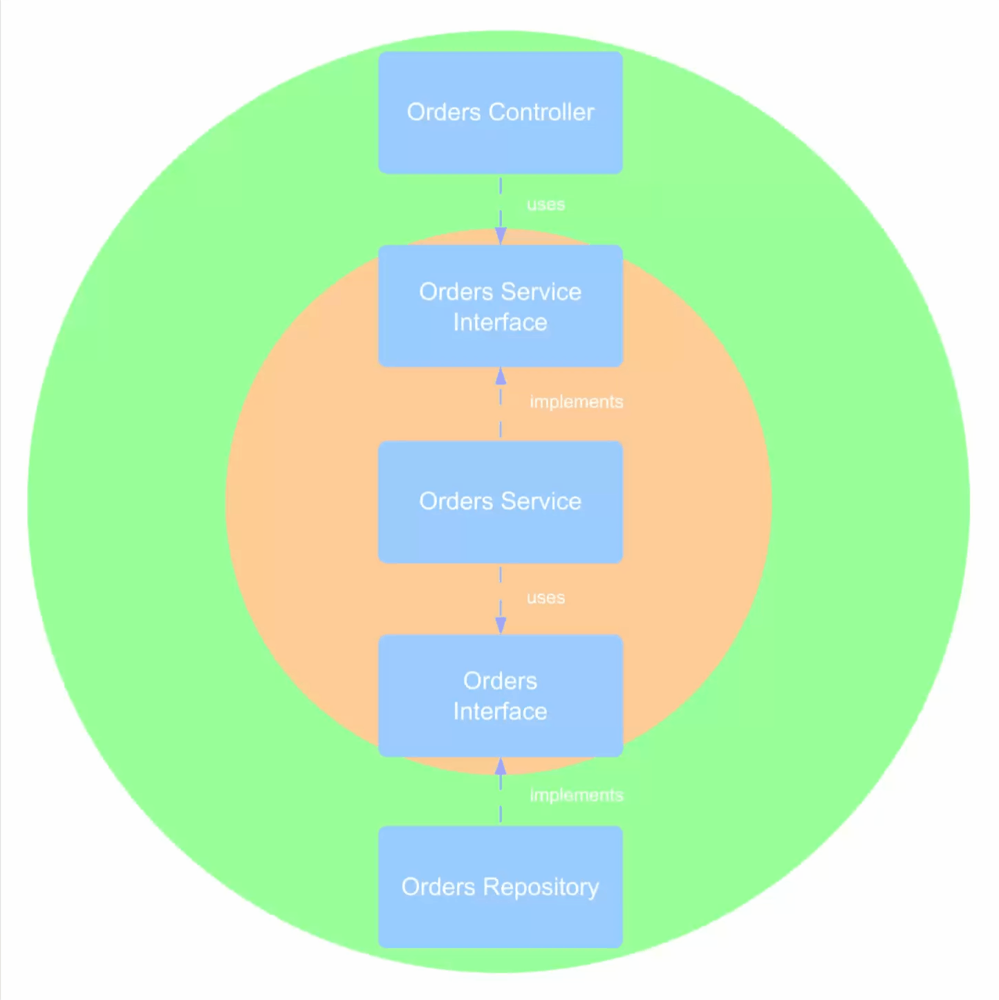

# Ports and Adapter in Hexagon

### Ports

### Adapters

#### Driver

A driver adapter DOESN'T implement a driver port. This is a mistake 
lot of people does. A driver adapter is a software component outside 
the application that uses a driver port. The driver port is a dependency
of the driver adapter. 

Examples of driver adapters: a MVC web controller, a REST controller, 
an automated test framework, etc

#### Driven

A driven adapter implement a driven port

### Hexagon

### Difference

#### Clean Architecture is Onion Architecture with more sensible naming

