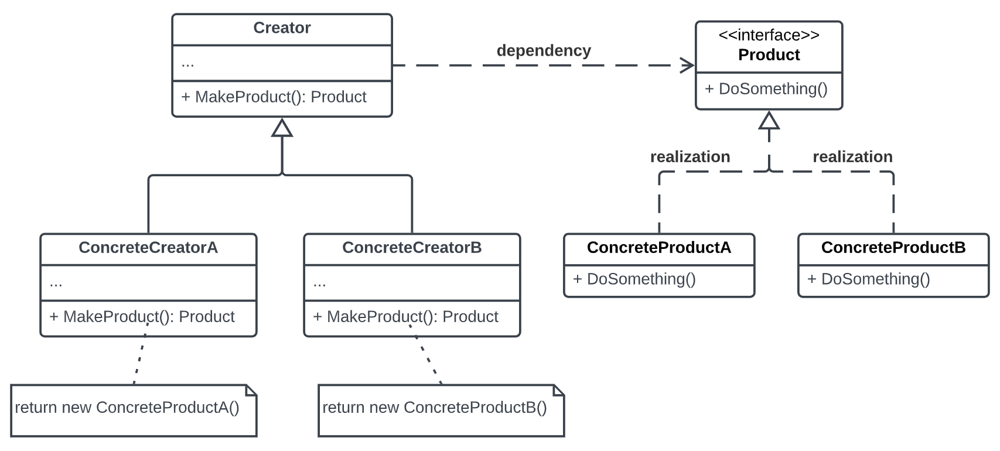

# Factory

**Factory** - class that usually delegates creation of object *with options*

Factory is creational pattern that lets you don't depend on concrete class.

Factory controls mutability of classes

Always requires interface

