# Pytest

### -v --verbose

#### Without

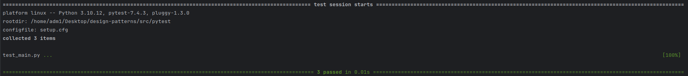

#### With

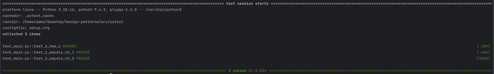

### -r... - info settings

f - failed

E - error

s - skipped

x - xfailed

X - xpassed

p - passed

P - passed with output

### --tb short | long (error table)

### -s -> prints

### -x -> stop after first failure

### --maxfail 3 -> stop after fourth failure

### pytest -m slow + you should register marker

### pytest --fixtures

### pytest -x --pdb -l (short vars) --showlocals (vars)

### Run concrete test

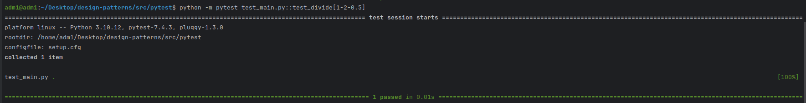

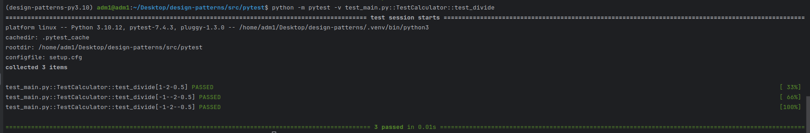

### Parametrize tests

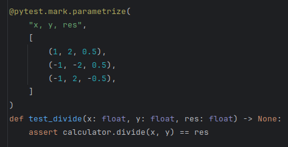

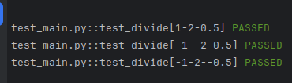

### Class tests

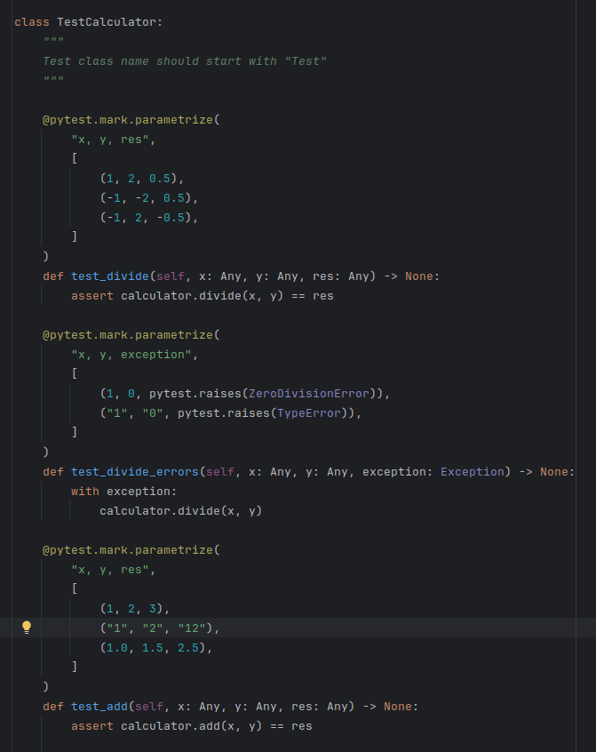

### Code without dependencies

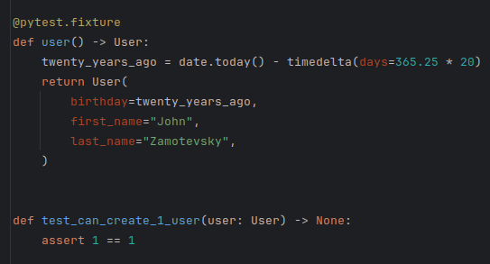

### Setup fixtures

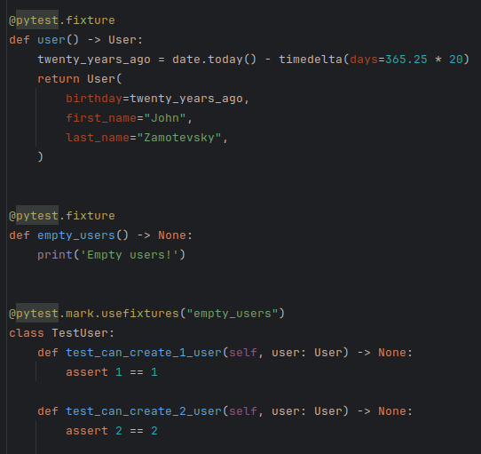

### Auto scope fixture

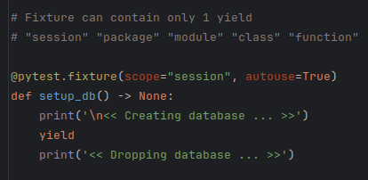

### Test Settings for DB

* pytest.env lib

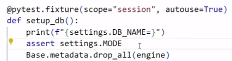

### Conftest.py

This file contains all global or local *fixtures*ss

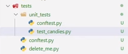
